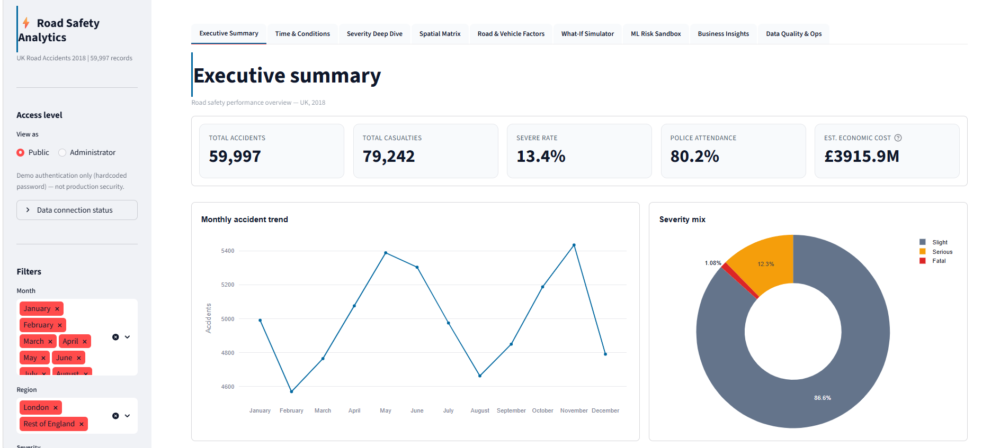
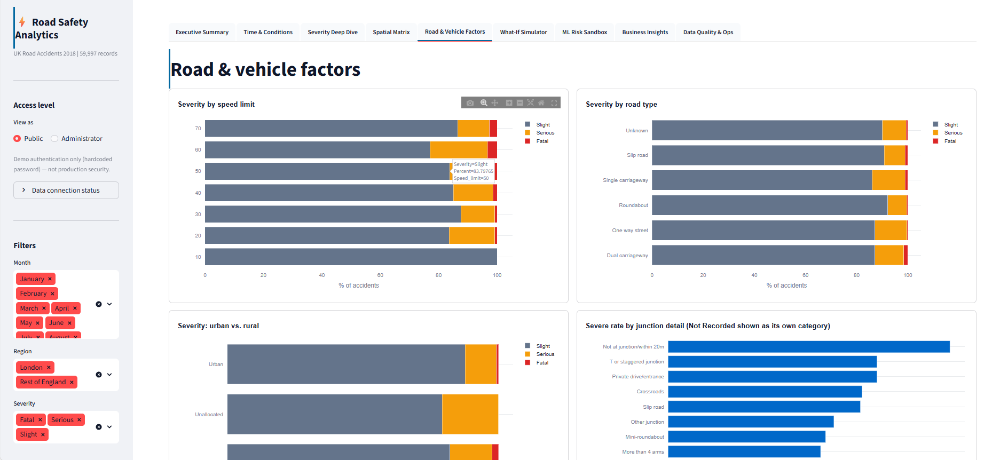

# 🚦 Road Safety Analytics Dashboard

An end-to-end analytics application built on 59,997 UK road-accident records (2018), combining executive-level KPI reporting, spatial and temporal analysis, a policy what-if simulator, and a live-trained machine learning risk model — all inside a 9-tab interactive Streamlit dashboard.

## 🔗 Live Demo

[Add your Streamlit Cloud link here once deployed]

## 📊 Overview

This dashboard was built to answer a simple question — *what actually drives accident severity, and where?* — while staying honest about what the data can and can't support. Rather than treating every number the same way, the app is explicit about which insights are grounded in the dataset and which are modeling assumptions.

**Key features:**
- **9-tab layout** covering executive KPIs, temporal trends, spatial severity breakdowns, a policy what-if simulator, and an ML risk sandbox
- **Live-trained ML model** — a scikit-learn Gradient Boosting classifier estimating severe-accident probability from weather, lighting, time-of-day, and speed-limit inputs, visualized through an interactive Plotly gauge
- **Data-quality-first approach** — every analysis is preceded by a defensive audit of the underlying data (see below)
- **Grounded vs. assumed insights** — the what-if simulator visually separates dataset-backed effects from external modeling assumptions, rather than blending real and assumed numbers together

## 🧠 Notable Engineering Decisions

**Data-quality audit before analysis**
Before building any spatial visualizations, I ran bounds checks on the latitude/longitude fields and found that 100% of coordinate values failed valid UK bounds. Rather than plot fabricated map points, I pivoted the spatial analysis to Local-Authority-level aggregation — a decision that prioritized accuracy over a "nicer-looking" but misleading map.

**Separating fact from assumption**
The what-if simulator distinguishes two categories of insight:
- *Dataset-grounded*: an observed severity gap between roundabouts and other junction types, drawn directly from the data
- *Externally assumed*: a modeled speed-camera effect, based on outside research rather than the dataset itself

These are visually separated in the UI so users never mistake an assumption for an observed result.

**Debugging a Streamlit rerun defect**
Diagnosed a bug where reassigning `st.plotly_chart` on every filter change caused chart-border containers to compound by one each rerun. Fixed it by replacing the pattern with a stateless wrapper function, which eliminated the defect across all 9 tabs.

## 🛠️ Tech Stack

| Category         | Tools                                       |
|------------------|---------------------------------------------|
| Language         | Python                                      |
| Framework        | Streamlit                                   |
| Data Processing  | Pandas, NumPy                               |
| Visualization    | Plotly (Express & Graph Objects)            |
| Machine Learning | scikit-learn (Gradient Boosting Classifier) |
| Styling          | Custom CSS theming                          |

## 📁 Dataset

- **Source**: UK Road Safety accident data (2018)
- **Size**: 59,997 records
- **Fields used**: severity, weather, lighting conditions, time-of-day, speed limit, junction type, location

## 🚀 Running Locally

Clone the repo and install dependencies:

```bash
git clone https://github.com/LakshmiPriyaV4/road-safety-analytics-dashboard
cd road-safety-analytics-dashboard
pip install -r requirements.txt
```

Run the app:

```bash
streamlit run app.py
```

Then open `http://localhost:8501` in your browser.

## 📂 Project Structure

road-safety-analytics-dashboard/
├── app.py                  # Main Streamlit entry point
├── requirements.txt        # Python dependencies
├── data/                   # Dataset (or download instructions)
└── README.md

> Adjust this structure to match your actual repo layout.

## screenshots 



## 🙋 About

Built by **Lakshmi Priya V**, B.E. Artificial Intelligence & Data Science student at Global Academy of Technology, Bengaluru.

- 📧 vlakshmipriya711@gmail.com
- 💼 [LinkedIn](https://www.linkedin.com/in/lakshmi-priya-v-b23590323)
- 🐙 [GitHub](https://github.com/LakshmiPriyaV4)